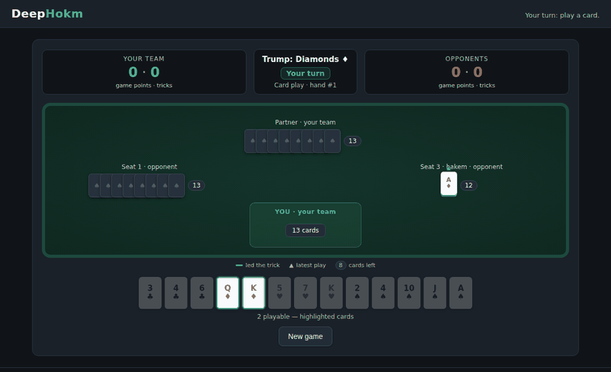
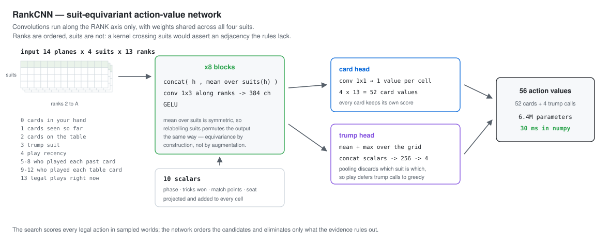

# DeepHokm

**Hokm** (حکم), the Persian trick-taking card game, played by a small
convolutional action-value network guiding a determinized search.

Beats a scripted greedy opponent in **85.5%** of matches (399 held-out matches,
95% CI [0.820, 0.889]) when paired with a live determinized search. The
default deployment serves the network alone instead -- no search, no
rollouts, an 18 ms decision -- which measures **66.3%** (80 held-out matches,
95% CI [0.559, 0.766]). Both are the same trained weights; search is a
deployment choice traded against latency, not a different model (see
[docs/DEPLOYMENT.md](docs/DEPLOYMENT.md) to enable it).

**No deep-learning framework at play time.** Inference is numpy; PyTorch
trains the network and converts its weights, and is a development dependency
only. Torch-free inference is enforced by a test that blocks the import and
plays a match anyway.



## Play it

```bash
uv sync
make webui        # http://localhost:8025
```

Play a seat against the model, or watch it play itself. The engine that serves
the UI is the same one used for evaluation.

## How it works

Each decision samples **determinized worlds** — full deals of the unseen cards
consistent with everything public: your hand, every card played, and the suit
voids revealed when a player fails to follow suit. Every legal card is played
out in each world, and a card beats the scripted baseline only by winning an
exact one-sided sign test, so the policy deviates on evidence rather than noise.
The network makes that search cheap: it scores all 52 cards in one pass, orders
the candidates, and lets the search eliminate an action only once the evidence
rules it out — never before it has been scored.



**Inference is numpy.** The trained weights are converted to a `.npz` archive
and the forward pass is reimplemented in numpy, so nothing at play time imports
PyTorch — a test enforces it by blocking the import and playing a match.

### What we tried, and what we kept

| idea | outcome |
|---|---|
| Self-play reinforcement learning (MaskablePPO, transformer) | **abandoned** — plateaued at the level of a greedy clone across every variant |
| Six network architectures, 377k to 8M parameters | **abandoned** — all landed in one band; a structure-free MLP matched the transformer |
| Regression on raw search values, scored by teacher agreement | **replaced** — 60% of decisions have tied best actions, so the metric graded coin flips |
| Distilling from a weak search | **replaced** — a student cannot exceed its teacher, and that one won only 73% |
| Pruning the search to the network's top choices | **replaced** — lost to plain search: an action never scored can never be chosen |
| **Suit-equivariant CNN + soft targets on decisive decisions + elimination search** | **kept** — the design above |

Each row is a measurement, not an opinion; the numbers behind them and how one
led to the next are in [the methods write-up](docs/METHODS_AND_RESULTS.md).

| policy | win rate vs greedy | matches | cost |
|---|---|---|---|
| Scripted greedy baseline | 0.500 | — | — |
| **Network alone, no search (default deployment)** | **0.663** | **80 ‡** | **18 ms** |
| Search alone, K=48 | 0.570 | 200 † | 1/64 of the budget below |
| Network + search, K=48 | 0.713 | 122 † | same budget |
| Search alone, K=3072 | 0.852 | 128 † | no network |
| Network + elimination search, K=3072 | 0.855 | 399 ‡ | 30 ms network + seconds of search |

‡ held-out seeds, disjoint from everything used to choose the model or its
settings; 95% CI [0.820, 0.889] for the search-paired row, [0.559, 0.766] for
the network-alone row.
† measured during development on the seed sets used for tuning, so these are
indicative rather than held-out.

The network does not raise the ceiling: it reaches the search's own level and
makes small-budget search substantially stronger. Why nothing in this family can
exceed the search it wraps is derived in
[the methods write-up](docs/METHODS_AND_RESULTS.md#19-why-the-hybrid-cannot-beat-the-search-it-wraps).

## Documentation

| | |
|---|---|
| [Methods and results](docs/METHODS_AND_RESULTS.md) | Every idea tried, what it measured, and why the design ended up here — including the approaches that failed |
| [Architecture](docs/ARCHITECTURE.md) | Environment, observation space, network, search |
| [Training](docs/TRAINING.md) | Label generation and the fitting procedure |
| [Rules](docs/RULES.md) | The exact Hokm variant implemented |
| [Deployment](docs/DEPLOYMENT.md) | Web UI, Docker, configuration |
| [Result tables](docs/RESULTS_TABLES.md) | Raw measurements from earlier phases |

## Development

```bash
make test         # pytest
make lint         # ruff + mypy
make bench        # environment throughput
```

Requires Python 3.10+ and [uv](https://github.com/astral-sh/uv).
