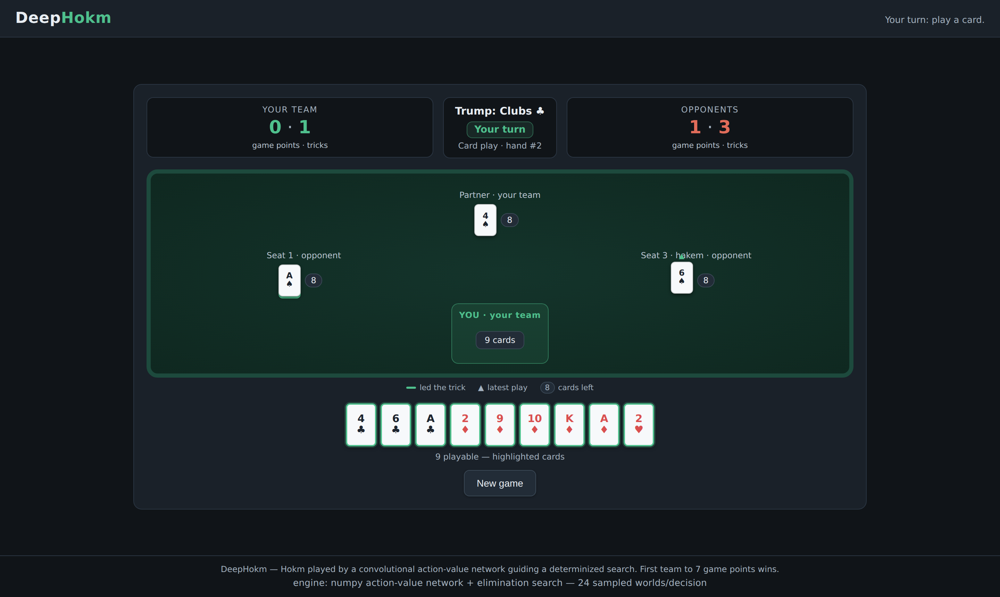

# Deployment

Running the web UI locally, in Docker, and the configuration surface.



The served policy is selected by `DEEPHOKM_POLICY`: `network` (the default)
uses the numpy action-value network, while `greedy` runs the deterministic
public-information heuristic without loading weights. `DEEPHOKM_QNET` points
at the Fast Q-pure archive. `DEEPHOKM_HARD_QNET` points at the distinct Hard
Q-hybrid archive trained from K=6144 teacher data. Players choose Fast
(network inference only) or Hard (the K=6144-trained network plus live search)
for each game. Startup validates the Hard archive against its feature contract,
including the recorded training K and weight hash, instead of silently reusing
the Fast model.
`DEEPHOKM_HARD_SEARCH_K` (default `384`) controls the Hard-mode search budget;
Fast never runs search. Higher Hard budgets trade latency for strength (3072
was measured at seconds per decision -- `DEEPHOKM_SEARCH_WORKERS` parallelizes
the rollouts to keep large budgets interactive). The training K=6144 is a
separate, offline, one-time cost that never runs at serve time regardless of
the live search setting.

```bash
make webui            # serves on ${DEEPHOKM_PORT}
```

Choose human play or AI-vs-AI spectating, then choose Fast or Hard strength.
Spectating advances one decision at a time (with auto-play). The UI shows the
table with seat attribution and trick order, trump, per-team tricks and game
points, whose turn it is, the current phase, and explicit card counts per
seat; illegal cards are visibly disabled and rejected server-side.


## Docker

```bash
cp .env.example .env    # edit per machine; set DEEPHOKM_GPU_DEVICE_ID
docker compose up --build -d
curl -fs "http://localhost:${DEEPHOKM_PORT}/health"
```

or plain docker (export the configuration first — `--env-file` only feeds the
container's environment, not the shell expansions in these flags):

```bash
set -a; . ./.env; set +a
docker build -t deephokm-web:latest .
docker run --rm -p "${DEEPHOKM_PORT}:${DEEPHOKM_PORT}" --tmpfs /tmp \
  --env-file .env deephokm-web:latest
```

The image is a multi-stage uv build. Both numpy Q-network archives are
committed and baked in by default: `checkpoints/qnet_numpy_full.npz` for Fast
and `checkpoints/qhybrid_k6144.npz` for Hard. The Hard archive ships with a
feature contract recording K=6144 and its exact hash, so a fresh
`docker compose up --build` supports both modes immediately. To bake different
archives, set `DEEPHOKM_QNET`, `DEEPHOKM_HARD_QNET`, and the matching
`DEEPHOKM_HARD_QNET_CONTRACT` in `.env` before building.

At run time read-only bind mounts can override the baked weights. Set
`DEEPHOKM_MODEL_PATH`, `DEEPHOKM_HARD_MODEL_PATH`, and the matching
`DEEPHOKM_HARD_MODEL_CONTRACT_PATH` in `.env` (absolute or relative to the
compose file). Their defaults are the repository archives, so the mounts are
no-op overrides rather than requirements. The container
never reserves a GPU device at all: numpy inference runs on CPU in ~30 ms
regardless (see `src/deephokm/nn/numpy_qnet.py`), so a mandatory device
reservation would only break `docker compose up` on a machine with no
nvidia container runtime for no benefit. `DEEPHOKM_GPU_DEVICE_ID` still pins
bare-metal training and the dev web UI server (`make train`, `make webui`)
to GPU 6 via `CUDA_VISIBLE_DEVICES`; it plays no role in the container. The
container runs as an unprivileged user with a RAM-backed `/tmp` and writes
nothing durable, so the only host state it needs is the mounted weights.

The earlier MaskablePPO checkpoint (`checkpoints/final.zip`) is not baked
into the image; it plateaued at the level of a greedy clone during
training (see [`METHODS_AND_RESULTS.md`](METHODS_AND_RESULTS.md)) and the
served app only falls back to it if the numpy weights are absent.


## Configuration

All deployment-specific values are environment variables documented in
[`.env.example`](.env.example) — GPU device id, web UI port, served model
paths, and the visual QA reviewer endpoint. Defaults live only there;
per-machine values live in a gitignored `.env`.
